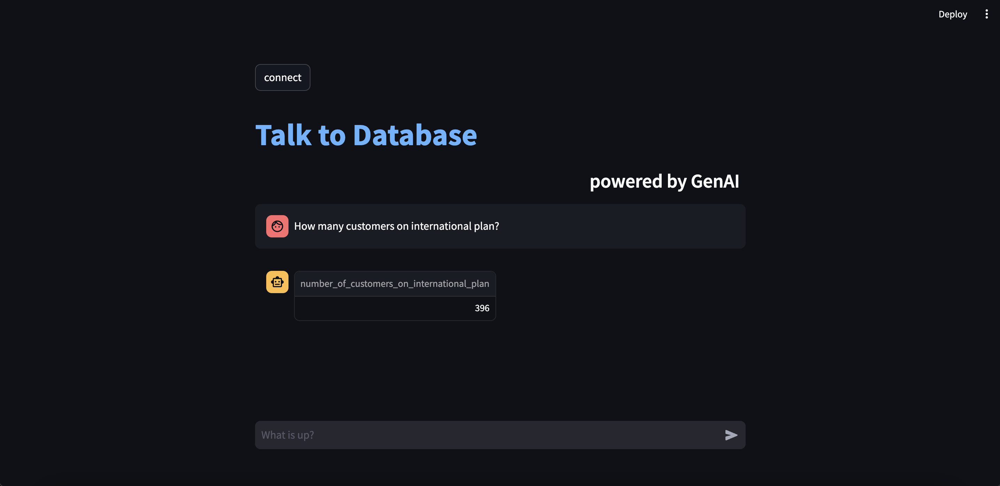

# AI-Studio-Project

**Break Through Tech AI Studio Project** - Verizon Team #2

**Authors** - Ria Kundu, Rachel Chan, Ami Rajesh, Meghana Killada, David Wang

**Description** - Our AI Studio Project for Fall 2024 is a machine learning model built using a supervised neural network that predicts wireless mobile subscriber churn using network location, network usage (voice/data), and customer service data.

**Features** -

**Technologies** -

## Instructions for Running Chatbot

1. Open terminal and make sure you are in the repo directory
2. Use command `pip install -r requirements.txt`
3. Use command `streamlit run gui.py`
4. Visit the generated link to view GUI

